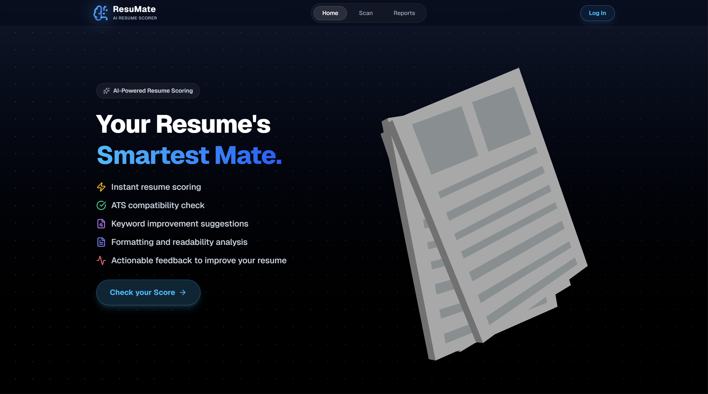

# 📄 ResuMate

[](#)
[](#)
[](#)
[](#)
[](#)

**ResuMate** is a full-stack, intelligent resume analysis web application. Designed to help job seekers stand out, ResuMate scans, evaluates, and provides actionable feedback on uploaded resumes. With interactive 3D elements and precise PDF highlighting, it offers a deeply engaging and modern user experience.

---

## Screenshot



---

## ✨ Key Features

* **Intelligent Resume Analysis:** Upload your resume to receive a comprehensive breakdown of your strengths, weaknesses, and areas for improvement.
* **Visual PDF Highlighting:** Don't just read the feedback—*see* it. ResuMate highlights specific coordinates directly on your PDF to point out exact issues.
* **Interactive 3D Interface:** A highly polished, modern UI featuring a custom 3D paper model (via React Three Fiber/Three.js) for an engaging user experience.
* **User Authentication:** Secure registration and login flows to keep your data private.
* **Persistent Reports:** Save your analysis reports to your profile, allowing you to track your resume improvements over time.
* **Responsive Design:** Fully optimized for both desktop and mobile viewing.

---

## 🛠️ Technology Stack

### Frontend (`/client`)
* **Core:** React.js, Vite
* **Styling:** Tailwind CSS (via `index.css` and standard component libraries)
* **3D Rendering:** `@react-three/fiber` & `@react-three/drei` (Rendering `Paper.glb`)
* **PDF Processing:** Custom PDF coordinate mapping & highlighting algorithms
* **State Management:** React Context API (`AppContext.jsx`)

### Backend (`/server`)
* **Core:** Node.js, Express.js
* **Database:** MongoDB, Mongoose (`models/Report.js`, `models/User.js`)
* **Authentication:** JSON Web Tokens (JWT) & bcrypt (`middleware/auth.js`)
* **Architecture:** MVC Pattern (Models, Views/React, Controllers, Routes)

---

## 🚀 Getting Started

Follow these instructions to set up the project locally on your machine.

### Prerequisites
Make sure you have the following installed:
* [Node.js](https://nodejs.org/en/) (v16.x or higher)
* [MongoDB](https://www.mongodb.com/) (Local instance or MongoDB Atlas cluster)
* Git

### 1. Clone the Repository
```bash
git clone https://github.com/your-username/resumate.git
cd resumate
```

### 2. Server Setup (Backend)
Navigate to the server directory and install the dependencies.
```bash
cd server
npm install
```

Create a `.env` file in the `server/` directory and configure the following variables:
```env
PORT=5000
MONGO_URI=your_mongodb_connection_string
JWT_SECRET=your_super_secret_jwt_key
# Add any necessary API keys (e.g., OpenAI/Gemini keys) if applicable to the analyzer
```

Start the backend development server:
```bash
npm run dev
```

### 3. Client Setup (Frontend)
Open a new terminal tab, navigate to the client directory, and install dependencies.
```bash
cd client
npm install
```

Create a `.env` file in the `client/` directory:
```env
VITE_API_BASE_URL=http://localhost:5000/api
```

Start the frontend development server:
```bash
npm run dev
```

The application should now be running. The frontend is typically accessible at `http://localhost:5173`.

---

## 📂 Project Structure

```text
resumate/
│
├── client/                     # Frontend React Application
│   ├── public/                 # Static assets (including 3D models like Paper.glb)
│   ├── src/
│   │   ├── api/                # Axios/Fetch API wrappers
│   │   ├── components/         # Reusable UI components (Navbar, Loader, Paper3D, etc.)
│   │   ├── context/            # React Context for global state
│   │   ├── lib/                # Utility libraries
│   │   ├── pages/              # Main route pages (Home, Analysis, Scan, Reports, etc.)
│   │   └── utils/              # Helper functions (fileParser, pdfCoords)
│   ├── vite.config.js          # Vite configuration
│   └── package.json
│
└── server/                     # Backend Node/Express Application
    ├── config/                 # Database and environment configurations
    ├── controllers/            # Business logic (Auth, Analyze, Reports)
    ├── middleware/             # Express middlewares (Auth guard)
    ├── models/                 # Mongoose database schemas
    ├── routes/                 # Express API routes
    ├── index.js                # Server entry point
    └── package.json
```

---

## 🤝 Contributing
Contributions, issues, and feature requests are welcome! 
Feel free to check the [issues page](#) if you want to contribute.

1. Fork the Project
2. Create your Feature Branch (`git checkout -b feature/AmazingFeature`)
3. Commit your Changes (`git commit -m 'Add some AmazingFeature'`)
4. Push to the Branch (`git push origin feature/AmazingFeature`)
5. Open a Pull Request

---

## 📝 License
Distributed under the MIT License. See `LICENSE` for more information.

---
*Crafted with ❤️ by the ResuMate Team.*